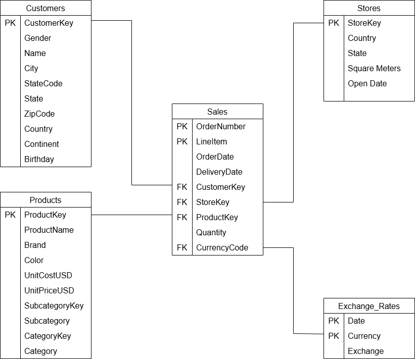

# VoltEdge Electronics: 2020 Sales Performance Analysis
## Project Background
VoltEdge Electronics, a global electronics retailer, faced a challenging year in 2020 due to the COVID-19 pandemic. Lockdowns, economic downturns, and shifts in consumer behavior significantly impacted sales performance. As a data analyst, my role is to evaluate the company’s sales trends, diagnose key problems, uncover growth opportunities, and provide strategic recommendations for 2020.
## Data Structure Overview
The analysis is based on data from five key tables:

1. **Sales**: Contains order details such as order number, product information, transaction dates, customer and store identifiers, and sales metrics.

2. **Customers**: Provides demographic and geographic details of customers, including gender, location, and birthdate.

3. **Products**: Lists product attributes such as name, brand, category, pricing, and cost details.

4. **Stores**: Contains store-specific information, including location, floor area, and store opening date.

5. **Exchange Rates**: Tracks currency exchange rates relative to the US dollar over time.

*Figure 1: Entity-Relationship Diagram (ERD) of the schema.*

## Executive Summary
VoltEdge Electronics suffered a **50% decline in total revenue**, dropping from **$19.8M in 2019 to $9.2M in 2020**. Profitability and order volume declined at the same rate. The peak sales month in **December 2020 reached only $650K**, a quarter of its previous year's peak.

- **Sales Trends**: The drop in revenue started in the second half of 2020, coinciding with government restrictions and declining consumer income.

- **Product Category Analysis**: **Computers ($3.7M), Cell Phones ($1.3M), and Home Appliances ($1.2M)** were the **top-performing categories**, while **Games & Toys, Audio, and Music/Movies/Audiobooks** were the **lowest-selling**.

- **Retail Store Performance**: Large stores generated **higher total sales**, but were **less efficient**, as measured by **revenue per square meter (RPSM)**. The **bottom-performing 1/3 of stores, which account for 40% of total retail space, have significantly lower efficiency**.

- **E-Commerce Growth**: Online sales **grew steadily, reaching 22.3% of total revenue** in 2020, but remain underdeveloped. However, **delivery efficiency improved significantly**, reducing the **average delivery time from 7.3 days (2016) to 4 days (2020)**.

A two-page interactive dashboard tracking sales performance is available <a href="https://public.tableau.com/app/profile/dung.duong.huynh5892/viz/GlobalElectronicsRetailerSalesDashboard/SalesPerformanceOverview" target="_blank">here.</a>

## Findings and Discussions

### 1. Sales performance Overview
- **Annual Revenue Decline**: 50% drop **from $19.8M (2019) to $9.2M (2020)**.

- **Gross Profit Decline**: Declined **from $10.7M to $5.45M**.

- **Order Volume Decline**: Fell **from 9,083 orders in 2019 to 4,635 orders in 2020**.

- **Seasonality Trends**: Sales patterns remained consistent, with **peaks in February and December**, and a **trough in April**, although absolute figures were significantly lower than the previous two years (Figure 2).

*Figure 2: Revenue declines significantly in 2020, compared to the two previous years.*

### 2. Sales by Category Analysis

**Best-Selling Categories:**

- **Computers**: $3.7M revenue (highest-performing segment)

- **Cell Phones**: $1.3M revenue

- **Home Appliances**: $1.2M revenue

**Lowest-Selling Categories:**

- **Games & Toys**: $154K revenue

- **Audio**: $453K revenue

- **Music, Movies & Audiobooks**: $566K revenue

**Market Insights:**

- Despite **increased digital entertainment consumption** (McKinsey, 2020)—with **49% of consumers watching more content, 36% gaming more, and 31% reading more** (Figure 3)— VoltEdge’s entertainment-related categories performed poorly. This highlights a **misalignment in marketing and product positioning** that needs to be addressed.

*Figure 3: 2020 sales by product category*

*Figure 4: Australians are consuming more digital content, especially entertainment.*

### 3. Retail Stores Performance

- **Metric Used**: **Revenue per Square Meter (RPSM)** as a measure of store efficiency.

- **Finding**: **Large stores generate higher total revenue but have lower efficiency**. Figure 4 highlights ten stores that account for **28% of the total store area but have the lowest efficiency**. These stores also have the highest total area, leading to high operational costs.

- **Implication**: Large stores with high operational costs and low efficiency need strategic intervention, such as closure, downsizing, or conversion to fulfillment hubs.

*Figure 5: Ten stores with the largest area but lowest revenue per square meter.*

### 4. Online vs. In-store Sales Comparison
- **E-Commerce Growth**: Online sales grew from **16.8% (2016) to 22.3% (2020)** of total revenue (Figure 6), but it remains **underdeveloped** compared to competitors.

- **Delivery Efficiency**: Average delivery time improved **from 7.3 days (2016) to 4.0 days (2018)** and has **remained stagnant at 4.0 days through 2020** (Figure 7), reflecting strong logistical readiness but limited recent progress, showing strong logistical readiness for further e-commerce expansion.

- **Consumer Trends (Accenture, 2020)**:

  - The pandemic accelerated e-commerce adoption by **160%**.

  - Consumers increasingly utilized **in-app purchases, home delivery, chat-based support, and other digital services**.
  
  - These omnichannel habits will likely persist post-pandemic, making digital transformation crucial  (Figure 8).

 *Figure 6: Gradual increase in the share of online sales as part of total sales (2016–2020).*

*Figure 7: Improved delivery time from 2016 to 2020.*

*Figure 8: Consumers using omnichannel services will continue*

https://www.mckinsey.com/industries/retail/our-insights/as-physical-doors-close-new-digital-doors-swing-open 
https://www.accenture.com/content/dam/accenture/final/a-com-migration/manual/r3/pdf/pdf-127/Accenture-COVID-19-CGS-Pulse-Survey-Research-Wave-4.pdf 
